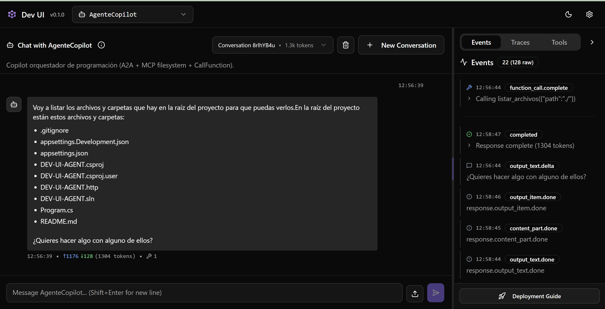
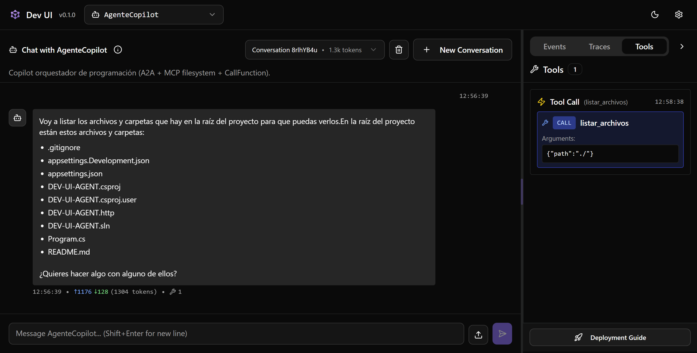

# DEV-UI-AGENT — PoC: Dev UI + Agent Framework (ASP.NET Core)



Este repositorio es una **prueba de concepto (PoC)** en **ASP.NET Core** cuyo objetivo es mostrar, de forma práctica, cómo funciona **Dev UI** del **Microsoft Agents / Agent Framework**.

La intención es que puedas:

- Levantar un backend local.
- Abrir **Dev UI** para probar conversaciones.
- Ejecutar herramientas (CallFunction / “tool calling”).
- Orquestar agentes (A2A) y herramientas tipo filesystem (MCP-style) dentro de un sandbox.
- Depurar el comportamiento observando **logs y consola** durante el desarrollo.

> Estado: **en desarrollo**. Este proyecto prioriza la experimentación y la exploración del framework por encima de “producto final”.

---


## Demo (2 minutos): levantar Dev UI y probar agentes

Esta sección está pensada para el “copiar/pegar y listo”. Hay dos caminos: **Azure OpenAI** (por defecto) u **Ollama** (local).

### Demo A — Azure OpenAI (recomendado si ya tienes el recurso)

1) Exporta credenciales (PowerShell):

```pwsh
$env:AZURE_OPENAI_ENDPOINT = "https://TU-RECURSO.openai.azure.com"
$env:AZURE_OPENAI_API_KEY = "TU_API_KEY"
$env:AZURE_OPENAI_DEPLOYMENT_NAME = "TU_DEPLOYMENT"

# (Opcional) sandbox de filesystem
$env:FileEditorRoot = "C:\\develop\\DEV-UI-AGENT"
```

2) Restaura y ejecuta:

```pwsh
dotnet restore
dotnet run --launch-profile https
```

3) Abre Dev UI:

- `https://localhost:7171/devui`

4) Prueba rápido:

- Selecciona `AgenteCopilot` y pídele que liste archivos con `listar_archivos(".")`.
- Pídele una operación simple tipo `sumar(2, 3)`.

### Demo B — Ollama (100% local)

1) Asegúrate de tener Ollama y un modelo descargado:

```pwsh
ollama pull llama3.1:8b
ollama serve
```

2) Configura variables de entorno:

```pwsh
$env:OLLAMA_ENDPOINT = "http://localhost:11434"
$env:OLLAMA_MODEL = "llama3.1:8b"

# (Opcional) sandbox de filesystem
$env:FileEditorRoot = "C:\\develop\\DEV-UI-AGENT"
```

3) Habilita Ollama en `Program.cs`:

```csharp
// AzureOpenAIConfig.Register(builder);
OllamaConfig.Register(builder);
```

4) Restaura y ejecuta:

```pwsh
dotnet restore
dotnet run --launch-profile https
```

5) Abre Dev UI:

- `https://localhost:7171/devui`

---

## 1) Qué estás viendo (idea general)

Dev UI necesita un host web que exponga endpoints HTTP “estilo OpenAI” para **Responses** y **Conversations**, además de registrar uno o más **AIAgents**.

Este proyecto hace exactamente eso:

- Configura un `IChatClient` (actualmente Azure OpenAI, con alternativa Ollama).
- Registra varios agentes de ejemplo.
- Mapea endpoints:
  - `/v1/responses`
  - `/v1/conversations`
- Expone la **Dev UI** cuando el entorno es `Development`.

---

## 2) Lo más importante: Dev UI se habilita con `Microsoft.Agents.AI.DevUI`

En el arranque del host, se usa el paquete y namespace:

```csharp
using Microsoft.Agents.AI.DevUI;
```

Esto permite:

- Registrar servicios para Dev UI.
- Mapear rutas para Dev UI.
- Tener una interfaz visual para iterar sobre prompts, herramientas, y conversaciones.

En `Program.cs` se ve el patrón típico:

```csharp
builder.Services.AddOpenAIResponses();
builder.Services.AddOpenAIConversations();

app.MapOpenAIResponses();
app.MapOpenAIConversations();

if (builder.Environment.IsDevelopment())
{
    app.MapDevUI();
}
```

---

## 3) Cómo se inicializa el proyecto (paso a paso)

El inicio ocurre en `Program.cs`:

1. **Construye el host web** (`WebApplication.CreateBuilder(args)`).
2. **Carga configuración** por variables de entorno (`builder.Configuration.AddEnvironmentVariables()`).
3. **Configura el modelo / chat client**:
   - `AzureOpenAIConfig.Register(builder)` (activo por defecto)
   - `OllamaConfig.Register(builder)` (alternativa, comentada por defecto)
4. **Registra agentes**:
   - `AgenteChat` (general)
   - `FileEditorAgent` (filesystem sandbox)
   - `AgenteFuncionesSimples` (CallFunction)
   - `AgenteCopilot` (orquestador)
5. **Registra/mapea endpoints** para que Dev UI pueda hablar con el backend.
6. **Expone Dev UI** solo en `Development`.

---

## 4) URL para arrancar (Dev UI y endpoints)

Según `Properties/launchSettings.json`, al correr en Development:

- HTTP: `http://localhost:5166`
- HTTPS: `https://localhost:7171` (y también `http://localhost:5166`)

**Dev UI** (solo `Development`):

- `http://localhost:5166/devui`
- `https://localhost:7171/devui`

**Endpoints que consume Dev UI**:

- Responses: `http://localhost:5166/v1/responses`
- Conversations: `http://localhost:5166/v1/conversations`

---

## 5) Requisitos previos

- .NET SDK compatible con el proyecto (target `net10.0`).
- (Si usas Azure OpenAI) Un recurso de Azure OpenAI y un deployment.
- (Si usas Ollama) Ollama corriendo localmente y un modelo descargado.

---

## 6) Cómo ejecutar en local (comandos necesarios)

### 6.1 Restaurar dependencias

```pwsh
dotnet restore
```

### 6.2 Compilar

```pwsh
dotnet build -c Debug
```

### 6.3 Ejecutar (perfil HTTPS recomendado)

```pwsh
dotnet run --launch-profile https
```

Luego abre:

- `https://localhost:7171/devui`

---

## 7) Configurar credenciales del modelo (Azure OpenAI u Ollama)

### Importante sobre secretos

**No deberías commitear claves**. Este repo incluye campos en `appsettings.Development.json` que parecen contener valores reales.

Recomendación práctica para desarrollo:

- Usa **variables de entorno**, o
- Usa **User Secrets** (`dotnet user-secrets`) si querés mantenerlo local.

### 7.1 Opción A — Azure OpenAI (por defecto)

El binding actual lo hace `Configuration/AzureOpenAIConfig.cs` usando:

- `AZURE_OPENAI_ENDPOINT`
- `AZURE_OPENAI_API_KEY`
- `AZURE_OPENAI_DEPLOYMENT_NAME`

Ejemplo en PowerShell:

```pwsh
$env:AZURE_OPENAI_ENDPOINT = "https://TU-RECURSO.openai.azure.com"
$env:AZURE_OPENAI_API_KEY = "TU_API_KEY"
$env:AZURE_OPENAI_DEPLOYMENT_NAME = "TU_DEPLOYMENT"

dotnet run --launch-profile https
```

### 7.2 Opción B — Ollama (local, sin Azure)

1) En `Program.cs`, deja comentado Azure y habilita Ollama:

```csharp
// AzureOpenAIConfig.Register(builder);
OllamaConfig.Register(builder);
```

2) Variables de entorno:

```pwsh
$env:OLLAMA_ENDPOINT = "http://localhost:11434"
$env:OLLAMA_MODEL = "llama3.1:8b"
```

3) Asegúrate de tener Ollama ejecutándose y el modelo disponible:

```pwsh
ollama pull llama3.1:8b
ollama serve
```

4) Ejecuta el host:

```pwsh
dotnet run --launch-profile https
```

---

## 8) Qué agentes incluye y para qué sirven

Este repo está pensado para **probar Dev UI + Agent Framework** con varios patrones:

### 8.1 `AgenteChat` (general)

- Propósito: conversación general en castellano.
- Prompt: `Prompts/GeneralAgenteChat.md`.

### 8.2 `FileEditorAgent` (MCP-style / filesystem sandbox)

- Propósito: exponer herramientas de filesystem (leer/escribir/listar/buscar) con **root seguro**.
- Configuración clave:
  - `FileEditorRoot` (en `appsettings*.json` o variable de entorno)

Herramientas típicas:

- `leer_archivo(path)`
- `leer_lineas(path, li, lf)`
- `escribir_archivo(path, contenido)`
- `reemplazar_linea(path, n, contenido)`
- `listar_archivos(path)`
- etc.

> Nota: esto no es “MCP server” formal; es un set de herramientas tipo MCP (misma idea: tool-calling para contexto/archivos), pero embebido en el backend.

### 8.3 `AgenteFuncionesSimples` (CallFunction)

Propósito: demostrar tool-calling básico con funciones simples (hora, fecha, operaciones, conversión, clima simulado, etc.).

### 8.4 `AgenteCopilot` (orquestador de programación)

Propósito: actuar como **agente orquestador** que combina:

- A2A: delega conversaciones a `AgenteChat`.
- MCP-style: expone filesystem delegando al `FileEditorAgent`.
- CallFunction: utilidades rápidas (hora/fecha/matemática/clima) para asistir en tareas.

Este agente se apoya en el prompt `Prompts/GeneralCopilotAgent.md`.

---

## 9) Debug, consola y trazas (en desarrollo)

El objetivo del PoC es facilitar el debug iterativo:

- Ver logs al ejecutar `dotnet run`.
- Iterar prompts y herramientas desde Dev UI.

`launchSettings.json` incluye `ENABLE_OTEL=true` como señal de telemetría en desarrollo (dependiendo de cómo la uses en tu instrumentación).

---

## 10) Checklist rápido

- `dotnet restore`
- Configurar modelo (Azure OpenAI u Ollama)
- `dotnet run --launch-profile https`
- Abrir `https://localhost:7171/devui`
- Probar:
  - Conversación con `AgenteChat`
  - Tool calling con `AgenteFuncionesSimples`
  - Operaciones de archivos con `FileEditorAgent`
  - Orquestación con `AgenteCopilot`

---

## 11) Troubleshooting (problemas comunes)

### 11.1 Dev UI no aparece (404 en `/devui`)

Checklist rápido:

- Asegúrate de correr en **Development**.
  - El perfil de ejecución del repo ya lo configura, pero si lo ejecutas “a mano”, valida:

```pwsh
$env:ASPNETCORE_ENVIRONMENT = "Development"
dotnet run --launch-profile https
```

- Verifica que el host esté exponiendo Dev UI solo en `Development`:
  - `app.MapDevUI();`

### 11.2 Problemas con HTTPS (certificado no confiable)

Si el navegador marca `https://localhost:7171` como inseguro, en Windows suele resolverse así:

```pwsh
dotnet dev-certs https --clean
dotnet dev-certs https --trust
```

Alternativa temporal: usar el perfil HTTP (sin TLS):

```pwsh
dotnet run --launch-profile http
```

y abrir:

- `http://localhost:5166/devui`

### 11.3 Puertos ocupados (la app no arranca)

Si `5166` o `7171` están en uso:

- Cierra el proceso que está ocupando el puerto, o
- Cambia `applicationUrl` en `Properties/launchSettings.json`.

Para inspeccionar el puerto en Windows:

```pwsh
netstat -ano | findstr ":5166"
netstat -ano | findstr ":7171"
```

### 11.4 Azure OpenAI: errores típicos de configuración

Síntomas comunes:

- Respuestas con error al iniciar conversación en Dev UI.
- Mensajes de error indicando `401/403` (key inválida/permisos), o `404` (deployment incorrecto).

Checklist:

- `AZURE_OPENAI_ENDPOINT` debe ser del estilo `https://<recurso>.openai.azure.com`.
- `AZURE_OPENAI_DEPLOYMENT_NAME` debe coincidir exactamente con el nombre del deployment.
- `AZURE_OPENAI_API_KEY` debe estar correcto y vigente.

Ejemplo recomendado usando variables de entorno:

```pwsh
$env:AZURE_OPENAI_ENDPOINT = "https://TU-RECURSO.openai.azure.com"
$env:AZURE_OPENAI_API_KEY = "TU_API_KEY"
$env:AZURE_OPENAI_DEPLOYMENT_NAME = "TU_DEPLOYMENT"
dotnet run --launch-profile https
```

### 11.5 Ollama: conexión rechazada o modelo inexistente

Síntomas:

- `Connection refused` / no conecta a `http://localhost:11434`.
- El modelo configurado no existe localmente.

Checklist:

```pwsh
ollama serve
ollama pull llama3.1:8b

$env:OLLAMA_ENDPOINT = "http://localhost:11434"
$env:OLLAMA_MODEL = "llama3.1:8b"
dotnet run --launch-profile https
```

### 11.6 FileEditorAgent: “Acceso fuera del directorio permitido”

Esto es esperable si el agente intenta leer/escribir fuera del sandbox.

Checklist:

- Revisa `FileEditorRoot` (en `appsettings*.json` o variable de entorno) y apunta al root deseado.
- Usa rutas relativas dentro de ese root.

Ejemplo:

```pwsh
$env:FileEditorRoot = "C:\\develop\\DEV-UI-AGENT"
```

## Nota final

Este repositorio es una **prueba de concepto** y seguirá cambiando. La meta es que sirva como “laboratorio” para probar **todas las capacidades de Dev UI y Agent Framework**, incluyendo iteración rápida, tool-calling, orquestación y depuración mediante consola.
